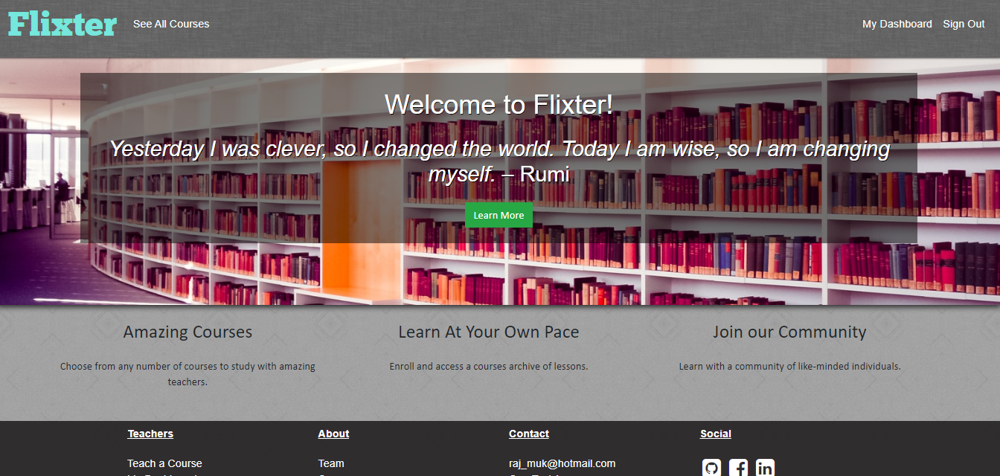
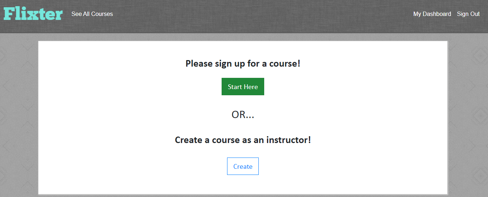
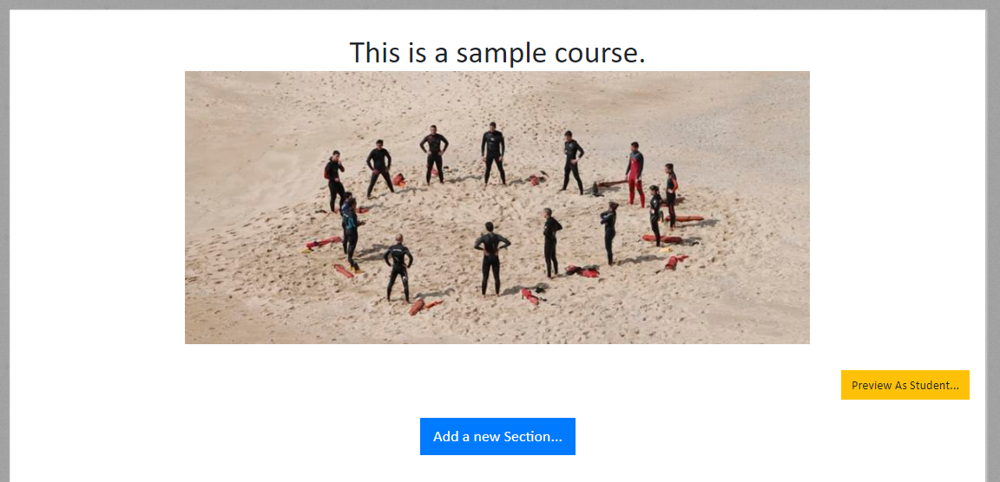
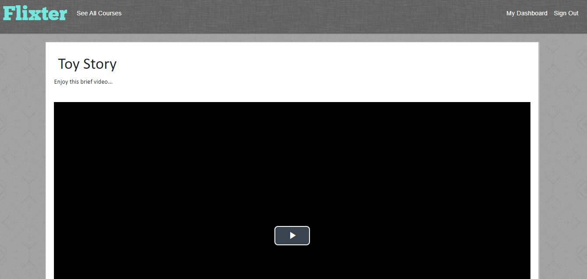
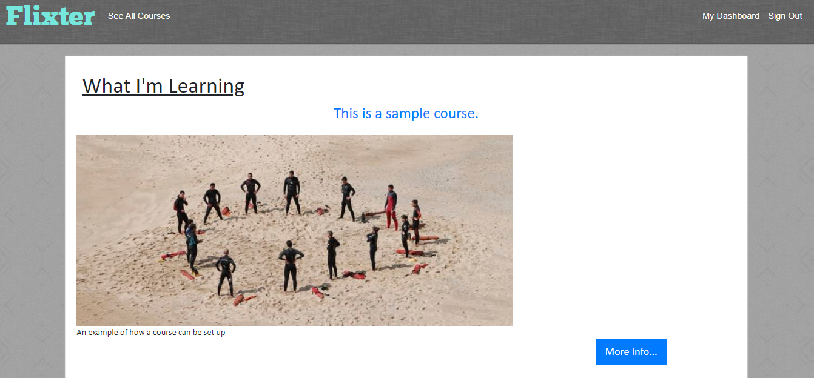

# Flixter

This is a website that allows for instructors to create tutorials. They can upload photos and videos for content. Other users can subscribe to the tutorials as well. Instructors may or may not charge a fee for a specific course.

The app was built within a Ruby on Rails framework. The information is saved to a PostgreSQL database. Most of the buttons were added using Bootstrap - in conjunction with HTML5 and CSS3. The Devise gem in Rails was used to authenticate users (both students and instructors). The Carrierwave gem helps with uploading images/videos. JavaScript was used as well: VideoJS was included for embedding videos, and the jQuery sortable function helped with reordering lessons and sections within courses.

A free course is available as a demo titled: "This is a sample course."

## Click [here](https://flixter-rajkumar-mukerjee.herokuapp.com/) to visit the website!

This is the home page:

An example of an empty dashboard that allows for course creation/subscription:

This is how the page looks when a course is initially created:

If you create multiple lessons within a section, you can sort them by dragging:

Note: The above example also applies to sections - you can reorder sections within a course. 

This is how the video page looks:

This is how your dashboard would look after you sign up for a course:

## Tools & Resources

* [Ruby on Rails](https://rubyonrails.org/) 
* [PostgreSQL](https://www.postgresql.org/)
* [Bootstrap](https://getbootstrap.com/)
* [Devise](https://github.com/plataformatec/devise/)
* [Carrierwave](https://github.com/carrierwaveuploader/carrierwave/)
* [VideoJS](https://videojs.com/)
* [jQuery: Sortable](https://jqueryui.com/sortable/)

Enjoy your day!